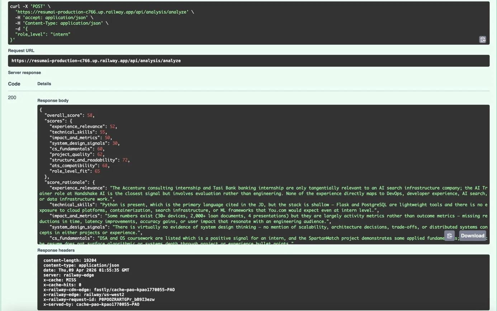

# ResumAI

ResumAI is a AI-powered resume analyzer that evaluates resumes against job descriptions using Claude, returning deep structured feedback across 9 scoring dimensions.

**Live API:** [https://resumai-production-c766.up.railway.app/docs](https://resum-ai-alpha.vercel.app/)

---

## What it does

Upload your resume and a job description — Resumai uses Claude to analyze your resume across:

- Experience relevance & company tier signal
- Technical skills & stack alignment
- Impact and metrics quality
- System design signals
- CS fundamentals visibility
- Project quality
- ATS compatibility
- Role level fit
- Structure and readability

Returns a hiring recommendation, keyword gap analysis, tech stack breakdown, and actionable improvement suggestions with example rewrites.

---

## Screenshots

### API Endpoints


### Live Analysis Response


---

## Tech Stack

| Layer | Technology |
|-------|-----------|
| Backend | FastAPI (Python) |
| AI | Anthropic Claude API |
| Database | PostgreSQL (Supabase) |
| PDF Parsing | pdfplumber, pytesseract |
| Deployment | Railway |
| CI/CD | GitHub → Railway auto-deploy |

---

## Architecture

```
POST /api/resume/upload-resume        # Upload PDF resume
POST /api/job-description/upload-job-description  # Paste job description  
POST /api/analysis/analyze            # Run Claude analysis
GET  /api/get-resume/get-resume       # Retrieve stored resume
```

Session-based auth via HTTP cookies — no login required. Analysis results cached in PostgreSQL to avoid redundant API calls.

---

## Local Setup

```bash
git clone https://github.com/darrensan8/resumai
cd resumai/backend
python3 -m venv .venv
source .venv/bin/activate
pip install -r requirements.txt
```

Create a `.env` file in the `backend` folder:

```
DATABASE_URL=your-supabase-connection-string
ANTHROPIC_API_KEY=your-anthropic-key
```

Run the server:

```bash
uvicorn main:app --reload
```

API docs available at `http://localhost:8000/docs`

---

## Background

Resumai is a rebuilt and deployed version of SpartanMatch — an earlier resume parsing project. This version migrates from Flask to FastAPI, OpenAI to Claude, local PostgreSQL to Supabase, and adds a production deployment with CI/CD.
